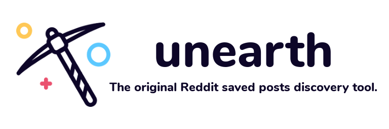

<p align="center">
  
</p>

**unearth** is a browser extension that takes over your browser's new tab page and displays a few of your saved posts in an effort to help you sift through [all those posts you saved](https://www.reddit.com/r/DoesAnybodyElse/comments/5uqziy/dae_save_a_reddit_link_just_to_never_look_at_it/) but [never looked at again](https://www.reddit.com/r/DoesAnybodyElse/comments/41t87f/dae_use_the_save_feature_on_reddit_and_then_never/).

> /user/\<user\>/saved - the subreddit that many create but never visit

## Community
It only makes sense that a Reddit application have its own subreddit, right? We think so - come join us at [r/unearthforreddit](https://www.reddit.com/r/unearthforreddit/)! Still in its infancy, but feel free to use the subreddit to crosspost some awesome posts you've found thanks to **unearth**, report bugs or request features, or read the release reports.

## Installing
Before installing, you will need:
- `node` version >= 8
- `npm`
- `git`

Once you have those installed:

```shell
# Clone this repository
$ git clone https://github.com/cedricium/unearth

# Go into the repository
$ cd unearth/

# Install the dependencies
$ npm install
```

## Building
To build the extension for use in the browser, use the `webpack` script:

```shell
$ npm run webpack
```

This will create a `build/` directory at the root of the project which contains all the necessary code bundled for a browser environment.

## Developing
Once you have the extension built, you're ready to begin testing. Use the `start` script to have the extension loaded in the browser (currently only Firefox supported):

```shell
$ npm start
```

`npm start` builds the extension then uses the `web-ext` CLI tool to load the `build/` directory in Firefox. A `--watch` flag is added to the script so that any changes made while running `npm start` will cause running extension to be live reloaded.

## Screenshot


## Contributing
Your contributions are always welcome! See an issue you want to tackle or have an idea for a feature you'd like implemented? Just open a pull-request with a short explanation of the changes and I'd be happy to review it.

## Licenses
You are free to copy, modify, and distribute **unearth** with attribution under the terms of the MIT license. See the [LICENSE](LICENSE.md) file for details.

- Animate.css - [MIT License](https://github.com/daneden/animate.css/blob/master/LICENSE)
- Bulma - [MIT License](https://github.com/jgthms/bulma/blob/master/LICENSE)
- Font-Awesome - [CC BY 4.0 License](https://creativecommons.org/licenses/by/4.0/)
- DOMPurify - [Apache License Version 2.0](https://github.com/cure53/DOMPurify/blob/master/LICENSE)

## Acknowledgements
- [Mining](https://thenounproject.com/term/pickaxe/1789074/) by Nikita Ryzhkov from the [Noun Project](https://thenounproject.com/)
- Nunito-ExtraBold.ttf: Copyright 2014 The Nunito Project Authors (contact@sansoxygen.com)
